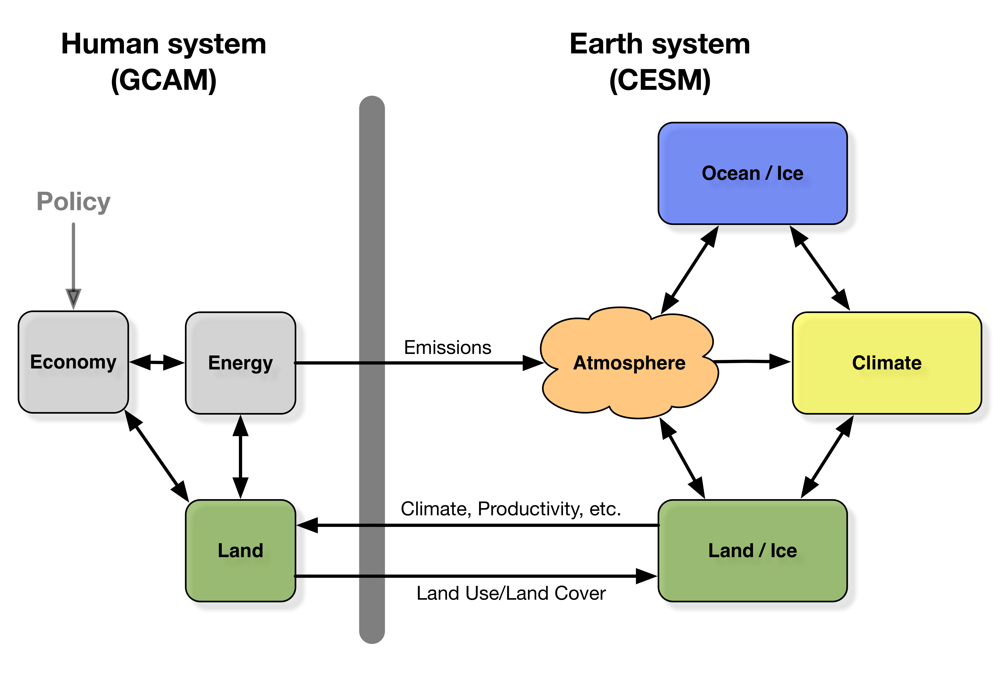

# The Integrated Earth System Model (iESM)

The Integrated Earth System Model (iESM) couples the Global Change Assessment Model (GCAM, www.globalchange.umd.edu/gcam) to the Community Earth System Model (CESM, http://www.cesm.ucar.edu/). The iESM represents a major new model capability that permits the exploration of process-level interactions among human and Earth systems that were previously not represented in the existing suite of computational tools and procedures. The initial version of the iESM focuses on carbon cycle interactions (see Figure), with the models exchanging information about land use, land cover, land productivity, and CO2 emissions. See Collins et al. (2015) for a complete technical documentation and Thornton et al. (2017) for an example of an analysis using iESM.

*iESM Coupling Schematic*


Please note further development on this model is not planned at this time. Future couplings between GCAM and ESMs will be via the ACME project on a separate repository. We anticipate releasing the GCAM-ACME coupled code with ACME version 2.  

This code is provided with no support. If you do have questions or comments, we suggest using GitHub issues, but we do not guarantee prompt responses.

## Using the iESM
We have created a User’s Guide to facilitate use of the model code. If you use the iESM in a publication, we suggest citing `Collins et al. (2015)` (below). Additionally, we suggest the following acknowledgment: “The development of the iESM was supported by the U.S. Department of Energy, Office of Science, Office of Biological and Environmental Research.”

## Selected References
Collins, W. D., A. P. Craig, J. E. Truesdale, A. V. Di Vittorio, A. D. Jones, B. Bond-Lamberty, K. V. Calvin, J. A. Edmonds, S. H. Kim, A. M. Thomson, P. Patel, Y. Zhou, J. Mao, X. Shi, P. E. Thornton, L. P. Chini and G. C. Hurtt (2015). "The integrated Earth system model version 1: formulation and functionality." Geosci. Model Dev. 8(7): 2203-2219.

Thornton, P. E., K. Calvin, A. D. Jones, A. V. D. Vittorio, B. Bond-Lamberty, L. Chini, X. Shi, J. Mao, W. D. Collins, J. Edmonds, A. Thomson, J. Truesdale, A. Craig, M. L. Branstetter and G. Hurtt (2017). "Biospheric feedback effects in a synchronously coupled model of human and Earth systems." Nature Climate Change. doi:10.1038/nclimate3310

## Acknowledgments
The development of the iESM was supported by the U.S. Department of Energy, Office of Science, Office of Biological and Environmental Research.

## Copyright Notice

Integrated Earth System Model software (“iESM”) Copyright (c) 2009 - 2016, The Regents of the University of California, through Lawrence Berkeley National Laboratory, Pacific Northwest National Laboratory, UT-Battelle LLC, through the Oak Ridge National Laboratory, University of Maryland, and other contributors(subject to receipt of any required approvals from the U.S. Dept. of Energy). All rights reserved.


If you have questions about your rights to use or distribute this software, please contact Berkeley Lab's Innovation & Partnerships Office at  IPO@lbl.gov.


NOTICE.  This Software was developed under funding from the U.S. Department of Energy and the U.S. Government consequently retains certain rights.  As such, the U.S. Government has been granted for itself and others acting on its behalf a paid-up, nonexclusive, irrevocable, worldwide license in the Software to reproduce, distribute copies to the public, prepare derivative works, and perform publicly and display publicly, and to permit other to do so.
